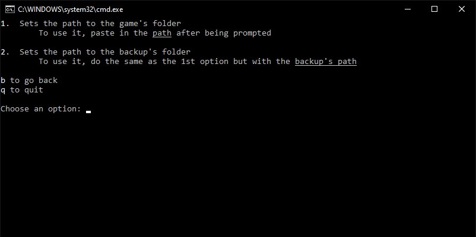

<h2><p style="color: yellow">🛑 WORK IN PROGRESS 🛑</p></h2>

# Hotline Miami 2 Mod Manager CLI

This is a Mod Manager designed to install, uninstall mods for Hotline miami 2 without the hastle of going back and forth with folders.

## How it works

Basically when you want to play a new level/campaign, you'll only need to put the .patchwad's and .wad's files in the same folder that the batch file is in and it'll do the work for you.

## How to set it up properly

You'll need 2 paths:
1. The path that leads to the _**game's main folder**_ ;
2. The path where you have stored the _**music file**_ ( .wad ) ;

To set them, just use the following parameters: 
```
/s        for the first
/s /b     for the second
```

Or you could set them by using the built-in "**GUI**", just click the .bat file like any executable.



## Paramaters available:
```
/i            Install all mods that are in the same folder

                 /x [path\to\compressed-file] 
                    Extracts the zip file inside %TEMP% and installs its contents

                 [URL]
                    Downloads the file from an url and installs it
                    NOTE: if it's not from DropBox, it'll ask for user's confirmation
                    

/un           Uninstalls all mods that are in the same folder

/r            Resets everything back to normal

/s            Sets the path of the game's folder
                 /b Creates the backup's path
     
/settings     Shows all paths
                 /e Opens up the settings' folder via Explorer
```